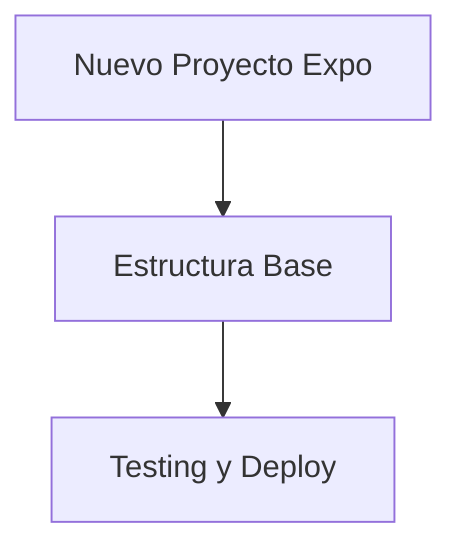

# Implementación - Plan de Ejecución

## Nuestra Decisión: Fresh Start

Después de revisar el código actual juntos, hemos tomado la decisión de **descartar completamente** la implementación existente y empezar desde cero. Aquí explicamos por qué y cómo lo haremos.

## Por Qué Empezar de Cero

El código actual tiene problemas fundamentales que hacen que sea más eficiente reescribirlo:
- **Arquitectura inconsistente**: No hay un patrón claro de organización
- **Deuda técnica masiva**: El código está tan enredado que migrarlo tomaría más tiempo
- **Tecnologías obsoletas**: Estamos usando versiones viejas y patrones deprecated
- **Sin estructura escalable**: No está preparado para crecer con el equipo

### Nuestro Enfoque
- **Codebase limpio**: Vamos a construir con las mejores prácticas desde el día 1
- **Arquitectura moderna**: Expo Router, TanStack Query, arquitectura feature-based
- **Solo backup de referencia**: Guardamos /screens/ por si necesitamos consultar algo
- **Desarrollo eficiente**: Sin las limitaciones del código legacy

## Plan de Implementación

Hemos dividido el trabajo en 3 fases claras para que podamos avanzar de manera ordenada:

1. **[Preparación del Entorno](./01-preparacion.md)** - Vamos a crear un proyecto Expo completamente nuevo
2. **[Estructura Base](./02-reestructuracion.md)** - Implementamos la arquitectura feature-based que diseñamos
3. **[Testing y Deploy](./03-testing.md)** - Validamos todo y preparamos para producción

## Herramientas Necesarias

### Desarrollo
- Node.js 22 LTS+ 
- npm
- Expo CLI
- Visual Studio Code (recomendado)

### Testing
- Expo Go app para testing en dispositivo
- Android Studio / Xcode para simuladores
- Firebase Emulator Suite (opcional)

## Lo Que Necesitamos del Equipo

### ⚠️ Antes de Empezar
- **Hacer backup**: Mover la carpeta /screens actual a /backup/screens/ (solo por si acaso)
- **Nuevo branch**: Crear un branch `feature/fresh-implementation`
- **Firebase**: Vamos a preparar un nuevo Firebase project limpio
- **Coordinación**: Este es un cambio grande, pero va a valer la pena

### ✅ Mientras Trabajamos
- **Commits frecuentes**: Cada feature que se complete, commit inmediatamente
- **Prueben todo**: No subir nada sin probarlo antes
- **Sigan las convenciones**: Vamos a ser estrictos con las reglas que establecimos
- **Comunicación constante**: Si hay dudas o problemas, comunicar inmediatamente

### 🎯 Al Finalizar
- **Testing completo**: Pruebas en múltiples dispositivos
- **Performance check**: Verificar que la performance sea igual o mejor
- **Documentation update**: Actualizar toda la documentación
- **Team training**: Capacitar al team en los nuevos patrones

## Estructura de Archivos de Migración

Cada archivo de migración contiene:
- **Objetivo**: Qué se logra en esa fase
- **Prerrequisitos**: Qué debe estar completado antes
- **Pasos detallados**: Instrucciones paso a paso
- **Validación**: Cómo verificar que se completó correctamente
- **Troubleshooting**: Soluciones a problemas comunes
- **Próximos pasos**: Qué sigue después

## Roadmap de Implementación

## Empezar la Implementación

Para iniciar la implementación, empezamos con **[01 - Preparación](./01-preparacion.md)**.

**Importante**: Seguimos el orden establecido. Cada fase construye sobre la anterior para una implementación sólida.

---

## 📖 Navegación

**Anterior:** [TanStack Query - Configuración](../03-tanstack-query/04-configuracion.md) | **Siguiente:** [Preparación del Entorno](./01-preparacion.md)