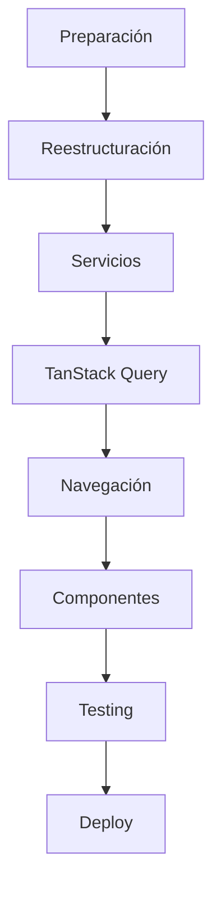

# Migración - Guía Completa

## Introducción

Esta sección contiene la guía paso a paso para migrar el proyecto actual a la nueva arquitectura. La migración está diseñada para ser **incremental** y **sin interrupciones**, permitiendo que el proyecto siga funcionando durante el proceso.

## Estrategia de Migración

### Enfoque Incremental
- **Sin interrupciones**: El app sigue funcionando durante la migración
- **Feature por feature**: Migramos una funcionalidad a la vez
- **Testing continuo**: Cada paso se prueba antes de continuar
- **Rollback ready**: Posibilidad de revertir cambios si hay problemas

### Fases de Migración

1. **[Preparación del Entorno](./01-preparacion.md)** - Setup inicial y dependencias
2. **[Reestructuración de Carpetas](./02-reestructuracion.md)** - Nueva organización de archivos
3. **[Migración de Servicios](./03-migracion-servicios.md)** - Refactor de capa de servicios
4. **[Implementación TanStack Query](./04-implementacion-query.md)** - Integración de queries y mutations
5. **[Migración de Navegación](./05-migracion-navegacion.md)** - Nuevo sistema de rutas
6. **[Migración de Componentes](./06-migracion-componentes.md)** - Refactor de UI components
7. **[Testing y Validación](./07-testing.md)** - Pruebas y validación final

## Tiempo Estimado

La migración completa puede tomar entre **2-4 semanas** dependiendo de:
- Tamaño del codebase actual
- Disponibilidad del equipo de desarrollo  
- Cantidad de features custom existentes
- Nivel de testing requerido

## Herramientas Necesarias

### Desarrollo
- Node.js 16+ 
- npm o yarn
- Expo CLI
- Visual Studio Code (recomendado)

### Testing
- Expo Go app para testing en dispositivo
- Android Studio / Xcode para simuladores
- Firebase Emulator Suite (opcional)

## Consideraciones Importantes

### ⚠️ Antes de Comenzar
- **Backup completo**: Haz un backup del proyecto actual
- **Branch de migración**: Crea un branch dedicado para la migración
- **Testing environment**: Configura un entorno de testing
- **Team coordination**: Asegúrate que todo el team esté al tanto

### ✅ Durante la Migración
- **Commits frecuentes**: Haz commit de cada paso completado
- **Testing continuo**: Prueba cada cambio inmediatamente
- **Documentación**: Documenta cualquier desviación del plan
- **Comunicación**: Mantén al team informado del progreso

### 🎯 Al Finalizar
- **Testing completo**: Pruebas en múltiples dispositivos
- **Performance check**: Verificar que la performance sea igual o mejor
- **Documentation update**: Actualizar toda la documentación
- **Team training**: Capacitar al team en los nuevos patrones

## Estructura de Archivos de Migración

Cada archivo de migración contiene:
- **Objetivo**: Qué se logra en esa fase
- **Prerrequisitos**: Qué debe estar completado antes
- **Pasos detallados**: Instrucciones paso a paso
- **Validación**: Cómo verificar que se completó correctamente
- **Troubleshooting**: Soluciones a problemas comunes
- **Próximos pasos**: Qué sigue después

## Roadmap de Migración

## Comenzar Migración

Para iniciar la migración, comienza con **[01 - Preparación](./01-preparacion.md)**.

**Importante**: No saltes pasos. Cada fase depende de las anteriores para funcionar correctamente.